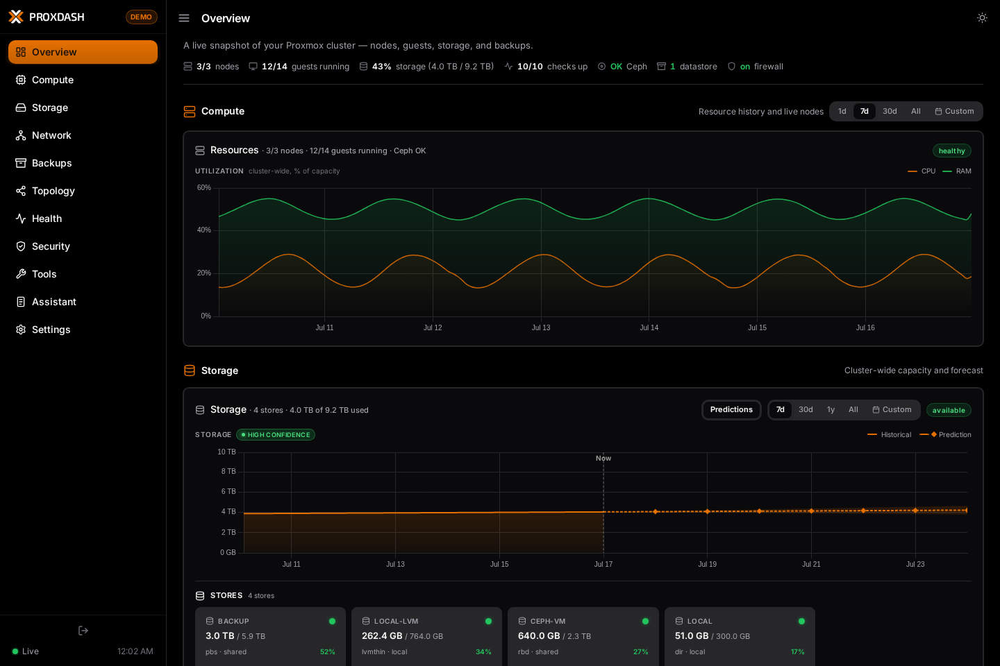
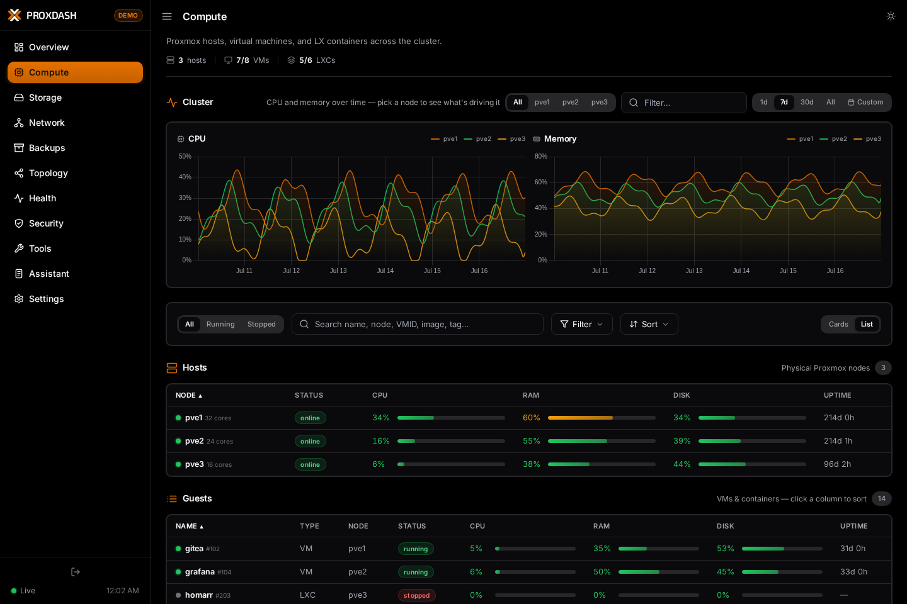
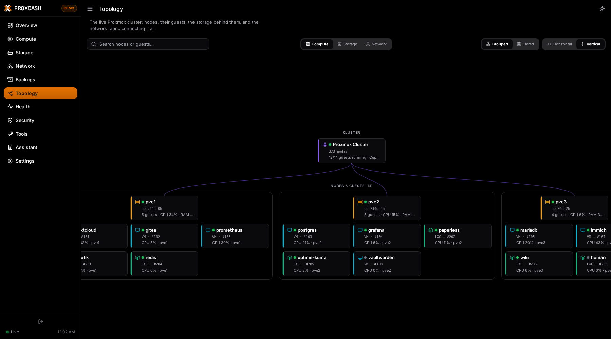

# ProxDash

**The real-time Proxmox dashboard** — a turnkey, live observability panel for your homelab.

[](LICENSE)
[](docker-compose.yml)

## What it is

ProxDash is a live, WebSocket-streamed dashboard for Proxmox VE. It provides purpose-built views for cluster nodes, VMs, LXCs, storage, Ceph, Proxmox Backup Server, networking, security posture, health, and topology.

It is **not** a customizable launcher or a board you assemble tile by tile. The layout is fixed and opinionated on purpose: you get purpose-built pages with real metrics the moment you point it at your gear — no widgets to arrange, no dashboards to design. The edge is Proxmox depth, real-time data, and zero assembly.

## Screenshots

_Screenshots coming soon._

<!--



-->

## Features

- Live node, VM, and LXC CPU, memory, disk, and network metrics
- Storage inventory, utilization history, content summaries, and drive health
- Ceph pools, OSD status, capacity, throughput, and cluster health
- Proxmox Backup Server datastore usage and snapshot listings
- Node interfaces, bridges, VLAN attachment, and guest traffic composition
- Cluster topology and searchable guest inventory
- Proxmox access, firewall, repository, subscription, and 2FA posture
- Automatic cluster health checks plus optional generic HTTP checks
- Historical charts backed by SQLite, including optional Proxmox RRD import
- Diagnostic tools: certificate checks, traceroute, network checks, and Wake-on-LAN
- Optional read-only AI assistant (TARS), using your own Anthropic API key
- Self-contained demo mode for evaluation without a Proxmox cluster

## Quick start

Docker Compose is the primary path:

```bash
git clone https://github.com/Manselm0/proxdash.git
cd proxdash
docker compose up -d
```

Then open **http://localhost:8080**.

The `./data` volume holds your config, sessions, and the stats database, so everything survives container rebuilds and upgrades.

## First run & auth

On first launch, the login page asks for a one-time setup token before it creates the local admin account. This prevents an unconfigured instance from being claimed by the first network client that finds it. The token is printed once in the startup log and stored owner-only as `setup-token.txt` in the data directory (`./data` with Docker, `/opt/proxdash` by default for a bare install). For Docker, retrieve it with `docker compose logs proxdash` or `docker compose exec proxdash cat /data/setup-token.txt`. The file is deleted after the admin is created.

For a trusted LAN-only deployment where you don't want a login wall, set `auth.enabled: false` in your config. Auth defaults to **enabled** (fail-closed), so anything you expose publicly requires login unless you deliberately turn it off.

When HTTPS terminates at a reverse proxy and ProxDash itself sees HTTP, set `auth.cookie_secure: true` so session and CSRF cookies retain the `Secure` flag.

## Configuration

Day-to-day configuration lives in the in-app **Settings** page. Configure Proxmox VE, optional Proxmox Backup Server access, health checks, tools, branding, and TARS there.

- [`config.yaml.example`](config.yaml.example) documents every available option and is worth a read.
- On first run the app seeds `config.yaml` into the data volume from that example.
- `PROXDASH_DATA` sets the data directory (default `/data` in Docker); config, sessions, and the SQLite databases all live there.

Proxmox API-token access is read-only in the dashboard. Use a dedicated token with the minimum documented audit permissions rather than a root credential.

## Footprint

ProxDash is lightweight: a single FastAPI process serving vanilla JavaScript, with **no heavy front-end framework**. Measured idle resident memory is **~65 MB**. That makes it comfortable to run in a small LXC or alongside everything else on a homelab host.

## Requirements

- **Docker** (recommended) — see Quick start above.
- **Or bare-metal** — Python 3.11+:
  ```bash
  pip install -r requirements.txt
  uvicorn main:app --host 0.0.0.0 --port 8080
  ```
- At least one **Proxmox** cluster to get the most out of it. Every other integration is optional.

## Development checks

Run `./build.sh` after changing `src/`, page fragments, or the shell. The release checks are:

```bash
python3 test/static_checks.py
python3 test/runtime_checks.py
python3 test/http_smoke.py
```

The runtime checks require the packages in `requirements.txt`; they use isolated temporary data and do not contact a Proxmox host. GitHub Actions runs the same checks on Python 3.11 and 3.13 and also builds the container image.

## License

ProxDash is licensed under the **GNU Affero General Public License v3.0**. See [LICENSE](LICENSE) for the full text.
